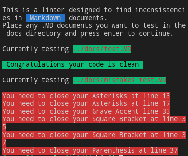

# Markdown Linter.

This is a linter build with Ruby to find errors in documents intended to be written with Markdown format.

The linter is design to check for inconsistencies in the opening and closing symbols used in the MarkDown syntax.

It will iterate for all the lines in a document passed and check the proper position of the elements that need opening and closure, in this syntax (bold, italics, links, and placeholder text containers).

`[link](https://www.markdownguide.org/cheat-sheet/) => # Correct syntaxys`

`!Cat sleep]inghttps://i.ytimg.com/vi/TvsNS48Pw5Q/maxresdefault.jpg) => # Incorrect Syntaxys`

## Screenshot showcasing the gameplay.

## Built with:
- Ruby

## How to use:
- Clone this repository by opening your terminal and run:
  git [clone](https://github.com/SigmaSam/MarkDown-Linter)

- Place the documents you want to test in the **docs** directory of the repository.

- run the `./main` command from the terminal in the bin directory.

- The console will show you the errors you had and will point you to the index of the line where they were found.

## Steps to validate code using out Rspec file.

- Once you have clone the repository make sure that you have Rspec install by running rspec --version
- If you do not have Rspec installed do so by following the Instructions [here](https://medium.com/@amliving/my-rails-rspec-set-up-6451269847f9)
- Then move to the directory spec and run this comand 'rspec'

## Authors.

👤 **Samuel Almao**
- Github: [@SigmaSam](https://github.com/SigmaSam)

## Contributing.
Bug reports and pull requests are welcome on GitHub at [this](https://github.com/SigmaSam/MarkDown-Linter)

## License.
The gem is available as open source under the terms of the [MIT License](https://opensource.org/licenses/MIT).
